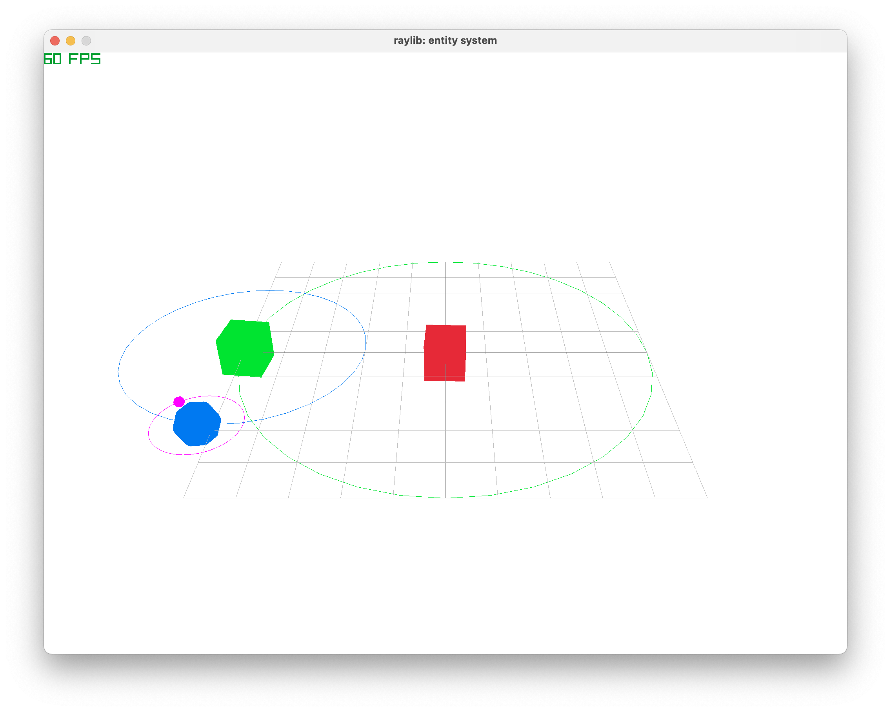

# raylib: simple entity system

online demo: https://seyhajin.itch.io/simple-entity-system


## Building for desktop

from *flux workspace dir*:
```cmd
./flux/flux build -config=release -target=desktop flux-samples/raylib/entity-system
```

## Building for web

from *flux workspace dir*:
```cmd
./flux/flux build -config=release -target=emscripten flux-samples/raylib/entity-system
```

launch server from *output dir*:
```cmd
python wasm-server.py
```
 open http://localhost:8080 to web browser


